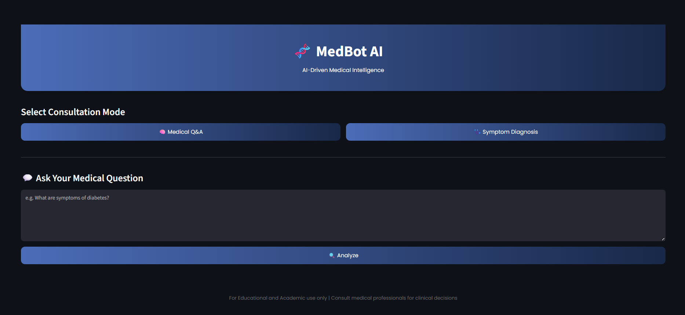
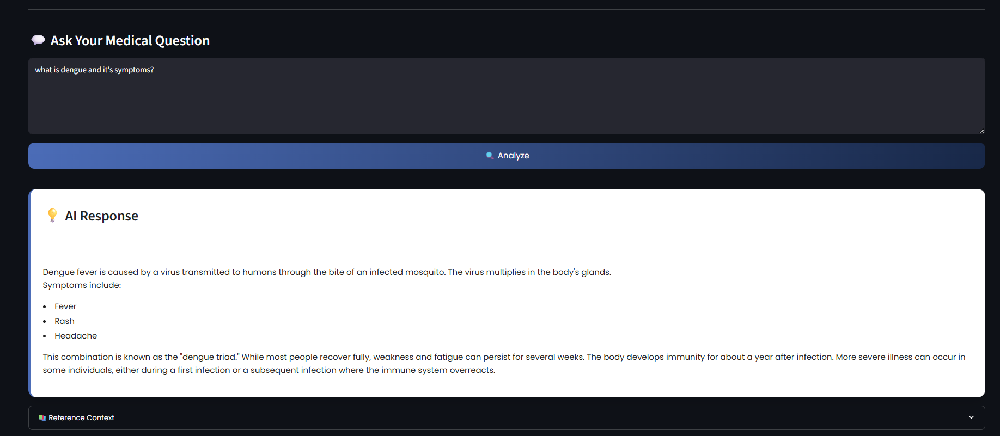
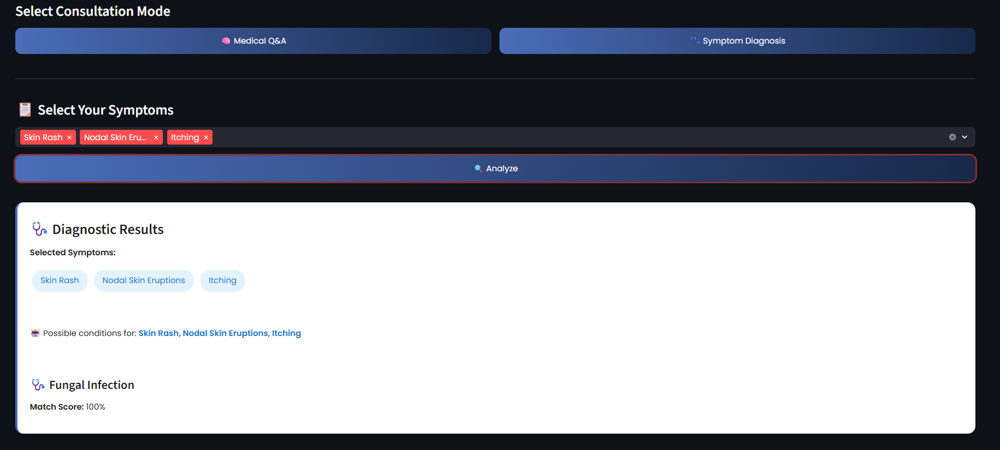

# 🧬 MedBot AI

**MedBot AI** is an intelligent, AI‑powered medical assistant that provides:
- 🧠 **Medical Q&A** via Gemini + LangChain RAG  
- 🩺 **Symptom-Based Disease Prediction** using a weighted rule-based engine  
- 🔍 Powered by LangChain, FAISS, and Gemini 1.5 Flash  
- 📚 Medical data from MedlinePlus XML and a PDF medical encyclopedia  

---

## 🚀 Features

### Symptom Diagnosis
- Select **one or more symptoms** from the dropdown  
- Returns top 3 likely diseases using this score:
  ```
  0.4 × Jaccard + 0.4 × Coverage + 0.2 × Precision
  ```
- If exact matches exist, only those appear  

### Medical Q&A (RAG-Based)
- Ask natural language medical questions
- Gemini retrieves context from:
  - MedlinePlus XML topics  
  - Encyclopedia PDF content  
- Provides grounded answers with reference citations

---

## 🧠 Tech Stack

| Component     | Technology                              |
|---------------|------------------------------------------|
| UI            | Streamlit                               |
| LLM           | Gemini 1.5 Flash (`google-generativeai`)|
| RAG           | LangChain + FAISS                       |
| Embeddings    | `all-MiniLM-L6-v2` (SentenceTransformer)|
| Agent         | LangChain Tool + Structured Chat        |
| Data Format   | MedlinePlus XML, Encyclopedia PDF, CSV  |

---

## 📁 Project Structure

```
medbot_ai/
├── app.py
├── agent_runner.py
├── build_langchain_kb.py
├── requirements.txt
├── README.md
├── .env                      # Add your API key here

├── data/
│   ├── disease_symptom.csv
│   ├── medlineplus_health_topics.zip  # download manually
│   └── encyclopedia.pdf               # your medical encyclopedia PDF

├── prompts/
│   └── prompt_templates.py

├── utils/
│   ├── rag_retriever.py
│   ├── symptom_agent.py
│   ├── symptom_checker.py
│   └── text_utils.py

└── knowledge_base/
    ├── index.faiss
    └── index.pkl
```

---

## 🛠️ Installation & Setup

```bash
git clone https://github.com/nishie24/medbot_ai.git
cd medbot_ai
pip install -r requirements.txt
```

Create a `.env` file:
```
GEMINI_API_KEY=YOUR_GOOGLE_GEMINI_KEY
```

Place these files under `data/`:
- `medlineplus_health_topics.zip`
- `encyclopedia.pdf`

Build the RAG index:
```bash
python build_langchain_kb.py
```

Run the app:
```bash
streamlit run app.py
```
## 🖼️ Screenshots

### 🏠 Homepage


### 💬 Medical Q&A


### 🩺 Symptom Diagnosis


---

## ⚠️ Disclaimer

This tool is for **educational and academic use only**.  
Not intended for clinical use—always consult licensed healthcare professionals for medical advice.
